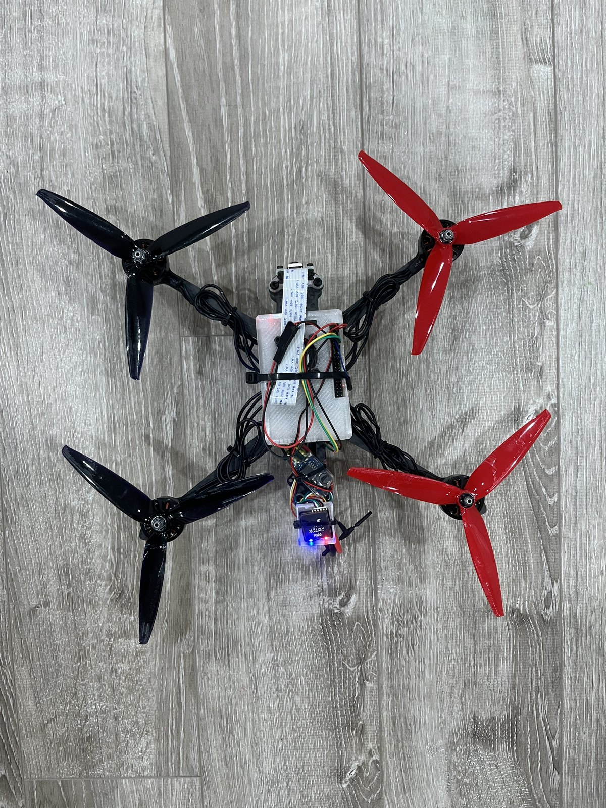
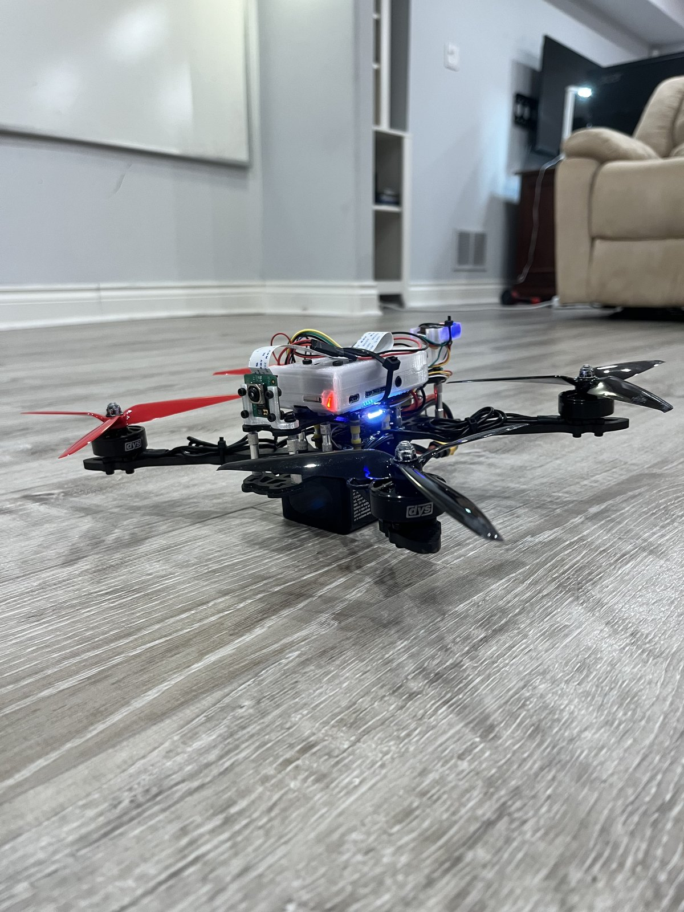

# Autonomous Drone

A 7-inch quadcopter that uses an onboard camera to locate an AprilTag and hold position relative to it—approximately one metre away, centred, and square to the tag’s face.

The system does not rely on GPS for AprilTag-relative positioning. Position information is derived entirely from the onboard camera. The Raspberry Pi can also perform OCR and other computer-vision tasks, provided they are not computationally demanding enough to interfere with the AprilTag tracking loop.

<p align="center">
  
  
</p>

## How It Works

A Raspberry Pi handles the vision system and outer control loop. It detects the AprilTag, converts the tag’s pose into the drone’s body frame, and calculates where the drone should be positioned: one metre outward along the tag’s normal vector.

A PD controller commands roll and pitch to move the drone toward that target position. Yaw is controlled independently to keep the nose pointed toward the tag, while thrust keeps the tag vertically centred in the camera frame.

The Raspberry Pi can concurrently perform other relatively low-cost computer-vision tasks. These tasks must remain computationally limited so that they do not interfere with the AprilTag tracking loop. Given the drone’s high thrust-to-weight ratio, a more powerful single-board computer, such as one from the NVIDIA Jetson Nano series, could be considered in the future.

The resulting commands are streamed to ArduPilot as attitude targets over MAVLink at 20 Hz while the flight controller operates in `GUIDED_NOGPS`.

ArduPilot remains responsible for all safety-critical flight functions, including:

* Attitude stabilisation
* Motor mixing
* Arming
* Flight-controller failsafes

The Raspberry Pi never arms the vehicle and never communicates directly with the motors.

The pilot engages and disengages the vision controller using a switch on the transmitter. This switch also acts as the emergency exit from autonomous control.

If the tag is lost, the controller does not attempt to estimate its position or begin searching. Instead, it falls back to a level, altitude-holding hover and reports that the tag has been lost.

## Future Ambitions

Future implementations may add OCR capability for warehouse environments, including operation in dark or poorly lit areas.

Detected text could be stored in an Excel spreadsheet for applications such as autonomous inventory management and inspection in difficult-to-reach warehouse locations.

This would most likely require:

* A mechanical camera-mounting system that further reduces vibration
* A mounted light or flashlight for illuminating dark areas
* Additional computational capacity if OCR or other vision workloads interfere with AprilTag tracking

## Hardware

| Component                | Specification                                                          |
| ------------------------ | ---------------------------------------------------------------------- |
| Airframe                 | 7-inch quadcopter, approximately 816 g, 6S                             |
| Flight controller        | SpeedyBee F405 V3, ArduCopter 4.6                                      |
| Companion computer       | Raspberry Pi 4                                                         |
| Camera                   | Raspberry Pi Camera Module 3, IMX708, 2 ms shutter, focus fixed at 1 m |
| Radio                    | ELRS                                                                   |
| Communication link       | Raspberry Pi ↔ flight controller over UART, MAVLink 2 at 921600 baud   |
| GPS and compass          | HGLRC M100 Pro GPS with QMC5883L compass                               |
| Custom 3D-CAD components | Raspberry Pi mount, camera mount, and GPS mount                        |

`GUIDED_NOGPS` is not included in the stock ArduPilot firmware for this flight controller because it is compiled out to conserve flash storage. The flight controller therefore runs a custom firmware build produced through ArduPilot’s build server.

## Current Status

The vision system, MAVLink connection, and control path are operational and validated.

In ArduPilot SITL, the controller successfully converges toward a virtual AprilTag from distances of approximately 4–6 metres and from both horizontal skew directions. It settles within a few centimetres of the target position without dropping a frame.

On the physical quadcopter, AprilTag detection currently operates successfully for approximately 80% of the runtime.

The primary remaining issue is mechanical vibration, which creates a visible “jello” effect in the camera image. This vibration must be addressed through improvements to the camera mounting system and mechanical isolation.

## Running the Project

No physical display is required. Each tool streams an annotated camera view to:

```text
http://<pi-ip>:8080/stream
```

### Hardware Tests

```bash
python3 vision_test.py
```

Tests the camera and AprilTag detection without using MAVLink.

```bash
python3 mavlink_test.py
```

Tests the MAVLink connection without using the camera.

```bash
python3 camera_tune.py
```

Sweeps camera exposure settings and measures detection reliability and pose jitter.

```bash
python3 hover_on_tag.py --dry-run
```

Runs the controller, calculates commands, and displays the output without sending commands to the flight controller.

### Simulator Tests

```bash
python3 sitl_validate.py
```

Confirms that the flight controller receives and processes attitude targets correctly and validates all control sign conventions.

```bash
python3 sitl_tag_sim.py
```

Runs the closed-loop controller against a virtual AprilTag in ArduPilot SITL.

## Camera Calibration

The following chessboard image is used for camera calibration:

```text
assets/calibration_chessboard.png
```

Camera calibration is performed using the two scripts located in the `calibration/` directory.

## Project Layout

```text
vision/       AprilTag detection, pose estimation, velocity estimation,
              camera configuration, and spike filtering

mavlink/      Communication link to the flight controller

streaming/    MJPEG streaming server

calibration/  Camera-calibration scripts
```

## License

This project is licensed under the MIT License. See [LICENSE](LICENSE) for details.
