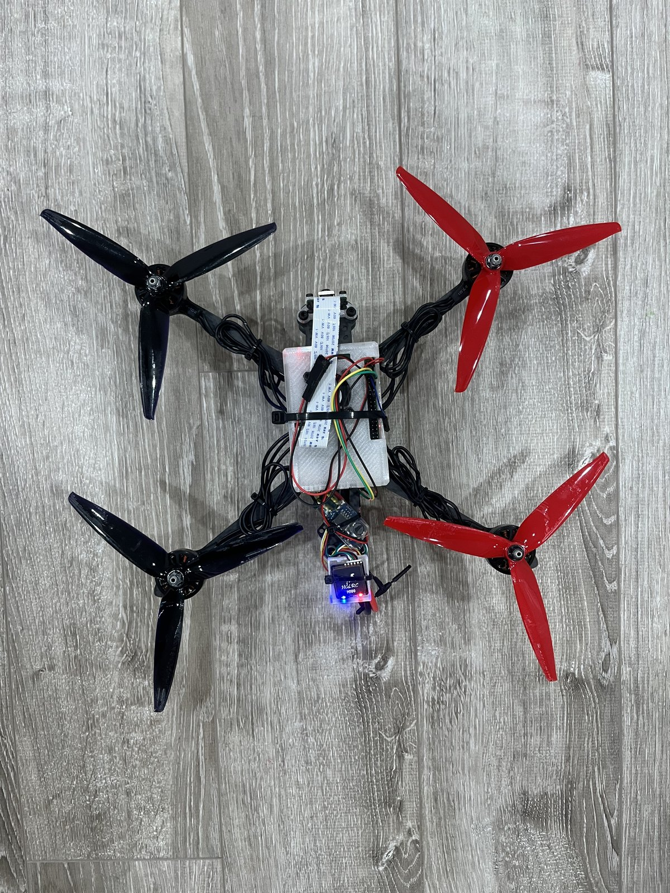
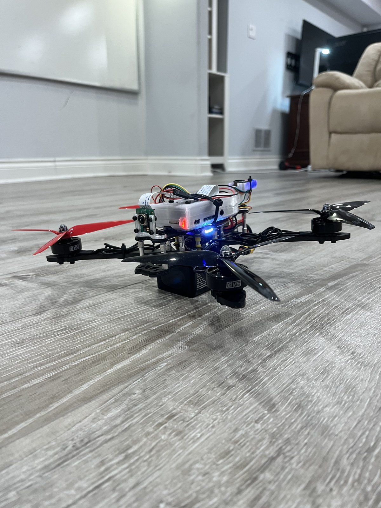
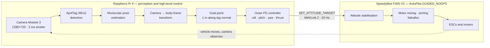
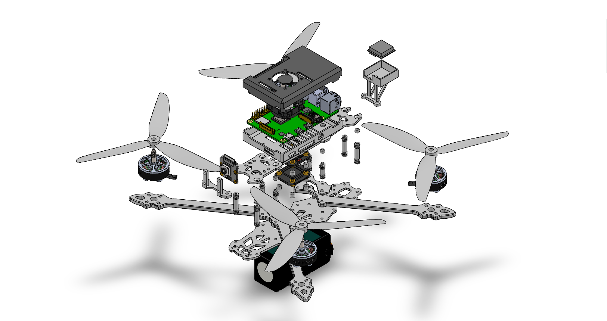
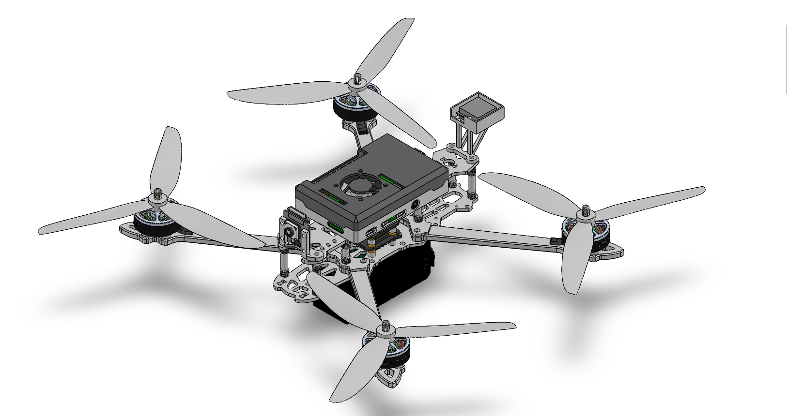

<h1 align="center">Vision-Guided Autonomous Drone</h1>

<p align="center">
  A custom-built 7-inch quadcopter that uses a Raspberry Pi and an onboard camera to
  detect an AprilTag and hold position relative to it — one metre out, centred, and
  square to the tag's face, with no GPS.
</p>

<p align="center">
  
  
  
  
</p>

<p align="center">
  
  
</p>
<p align="center"><sub>The airframe: Raspberry Pi 4 companion computer, Camera Module 3, and SpeedyBee F405 V3 stack on a custom 7-inch build.</sub></p>

<!--
  Media placeholders — uncomment as assets land, and promote to a "## Demonstration"
  section once there is more than one:
  
  
  
-->

---

## What it does

- Detects an **AprilTag (36h11)** in the camera feed and estimates its full 6-DoF pose
- Converts that pose into the drone's body frame and computes a **goal point one metre
  out along the tag's outward normal**
- Runs an **outer PD loop** that turns the goal-point error into roll, pitch, yaw, and
  thrust corrections
- Streams those as `SET_ATTITUDE_TARGET` to **ArduPilot over MAVLink at 20 Hz** in
  `GUIDED_NOGPS`
- Leaves **stabilisation, motor mixing, arming, and failsafes entirely to ArduPilot** —
  the Pi never arms the vehicle and never touches the motors

The pilot engages and disengages the controller with a transmitter switch, which doubles
as the emergency exit from autonomous control.

---

## System overview

The Raspberry Pi owns perception and high-level control. The flight controller owns
everything safety-critical.


```mermaid
flowchart LR
    subgraph PI["Raspberry Pi 4 — perception and high-level control"]
        direction TB
        A["Camera Module 3<br/>1280×720 · 2 ms shutter"] --> B["AprilTag 36h11<br/>detection"]
        B --> C["Monocular pose<br/>estimation"]
        C --> D["Camera → body-frame<br/>transform"]
        D --> E["Goal point<br/>1 m along tag normal"]
        E --> F["Outer PD controller<br/>roll · pitch · yaw · thrust"]
    end

    subgraph FC["SpeedyBee F405 V3 — ArduPilot GUIDED_NOGPS"]
        direction TB
        G["Attitude stabilisation"] --> H["Motor mixing · arming<br/>failsafes"]
        H --> I["ESCs and motors"]
    end

    F -->|"SET_ATTITUDE_TARGET<br/>MAVLink 2 · 20 Hz"| G
    I -.->|"vehicle moves, camera observes"| A
```

<!-- Optional: replace the Mermaid diagram above with assets/diagrams/system-architecture.svg -->

The Pi is an advisor; the flight controller is the authority. Arming, stabilisation, motor
mixing, and every failsafe stay with ArduPilot, which can be handed back to the pilot at any
moment with one switch.

---

## How the autonomy works

1. The camera captures a frame with a fixed 2 ms shutter and fixed focus, chosen to
   freeze airframe vibration rather than to look pretty.
2. The detector finds the tag and solves its pose from the four refined corners.
3. That pose is rotated from the OpenCV camera frame into ArduPilot's forward-right-down
   body frame, then shifted by the measured camera-to-flight-controller offset.
4. The controller computes the **goal point**: one metre out along the tag's outward
   normal. Driving straight at that point decouples position from viewing angle.
5. A PD law converts the goal-point error into roll and pitch, keeps the nose on the tag
   with an independent yaw correction, and holds height from the tag's vertical offset:

   ```
   pitch = K_p · e_forward + K_d · v_forward
   ```

   The derivative term is not optional. Tilt commands *acceleration* while the loop
   controls *position* — a double integrator, which pure proportional control cannot
   stabilise. In simulation the P-only version pinned maximum forward tilt and flew
   straight through the tag.
6. Commands are clamped, slew-limited, and streamed to ArduPilot at 20 Hz.
7. ArduPilot tracks the commanded attitude and drives the motors.

If the tag is lost, the controller does not guess or search. It falls back to a level,
altitude-holding hover and says so. A separate gate rejects single-frame pose spikes
caused by rolling-shutter distortion before they can reach the derivative term.

Full derivation, gain rationale, and sign conventions: **[Control system](docs/control-system.md)**.

---

## Technical overview

| Area                | Implementation                                                        |
| ------------------- | --------------------------------------------------------------------- |
| Airframe            | Custom 7-inch quadcopter, ~816 g, 6S                                  |
| Flight controller   | SpeedyBee F405 V3 running ArduCopter 4.6                              |
| Companion computer  | Raspberry Pi 4                                                        |
| Camera              | Camera Module 3 (IMX708), 1280×720, 2 ms shutter, focus fixed at 1 m  |
| Perception          | AprilTag 36h11 via OpenCV ArUco, monocular pose from tag corners      |
| Control             | Outer PD loop on relative position, yaw held on the tag bearing        |
| Communication       | Raspberry Pi ↔ FC over UART, MAVLink 2 at 921600 baud                 |
| Flight mode         | `GUIDED_NOGPS` (custom ArduPilot build — see below)                   |
| Simulation          | ArduPilot SITL, with a synthetic tag closing the full loop            |
| Mechanical design   | SolidWorks: custom Raspberry Pi, camera, and GPS mounts               |
| Radio / GPS         | ELRS; HGLRC M100 Pro GPS with QMC5883L compass                        |
| Language            | Python 3                                                              |

`GUIDED_NOGPS` is compiled out of the stock ArduPilot firmware for this board to save
flash, so the flight controller runs a custom build produced through ArduPilot's build
server.

---

## What I built

- **The whole vehicle.** Airframe selection and assembly, component choice, wiring, ESC
  and flight-controller configuration, and the Raspberry Pi and camera integration.
- **Custom mechanical parts** designed in SolidWorks — Raspberry Pi, camera, and GPS
  mounts, printed and fitted to the frame.
- **The perception pipeline**: camera configuration tuned specifically for a vibrating
  airframe, AprilTag detection, pose estimation, and the camera-to-body-frame transform.
- **The outer control loop**: goal-point geometry, PD law, deadbands, clamps, slew limits,
  and the failsafe state machine around it.
- **The ArduPilot integration**: the MAVLink link, the `SET_ATTITUDE_TARGET` stream, and
  the engage/disengage gating that keeps the pilot in charge.
- **The test infrastructure and the debugging**: SITL harnesses that exercise the real
  control code rather than a copy of it, a closed-loop simulator with a synthetic tag, and
  the measurement tooling that found the faults described in
  [Simulation and testing](docs/simulation-and-testing.md).

ArduPilot, OpenCV, the AprilTag family, MAVLink, and picamera2 are third-party projects.
My work is the vehicle, the perception and control code, and the integration between them.

---

## The airframe, in CAD

The mounts were modelled against measured component dimensions before anything
was printed. The exploded view is the clearest picture of how the vehicle is
actually stacked, and of which parts are custom: the Raspberry Pi tray, the
camera mount on the front standoffs, and the GPS mast that lifts the receiver
clear of the power wiring and the carbon.

<p align="center">
  
</p>
<p align="center"><sub>Exploded assembly — frame, motors, flight-controller stack, Raspberry Pi and cooler, camera mount, GPS mast, and the battery beneath the frame.</sub></p>

<p align="center">
  
</p>
<p align="center"><sub>The same assembly closed up. Compare with the photographs at the top: the build follows the model.</sub></p>

https://github.com/user-attachments/assets/23a327b6-904f-4b6b-ba47-4bf15ec50fc6

Because the mounts carry a camera whose pose is part of the control loop, their
geometry is not cosmetic: the camera-to-body transform in
[`vision/`](vision) assumes the camera sits where these parts put it.

---

## Status

| Component                                     | Status                                        |
| --------------------------------------------- | --------------------------------------------- |
| AprilTag detection and pose estimation         | Implemented · running on the vehicle          |
| Camera tuning for vibration and blur           | Implemented · measured on hardware            |
| MAVLink link and telemetry                     | Implemented · hardware tested                 |
| Outer PD controller                            | Implemented · tuned in SITL                   |
| Control path and sign conventions              | Verified in SITL (`sitl_validate.py`)         |
| Closed-loop convergence to a tag               | Verified in SITL (`sitl_tag_sim.py`)          |
| Camera intrinsic calibration tooling           | Implemented                                   |
| Autonomous position hold in physical flight    | **In development** — limited by vibration     |
| Inner-loop AUTOTUNE on the real airframe       | Not yet performed                             |
| OCR / warehouse inventory scanning             | Planned, not started                          |

**In simulation**, the controller converges on the tag from 4 m with +20° of skew and from
6 m with −35°, settling within 0.08 m of the setpoint distance, 0.01 m laterally, 0.05 m
vertically, and under 3° of residual skew, without losing a frame.

**On the physical drone**, detection and the MAVLink command path both work, but detection
currently holds for roughly 80% of flight time. The limiting factor is mechanical
vibration: the IMX708 is a rolling-shutter sensor, so vibration shears the image row by row
and corrupts the tag's corner geometry — which is exactly what the pose solve depends on.

Software has taken this about as far as it goes. A 2 ms shutter freezes the motion blur,
the fastest-readout sensor mode minimises the shear, and a pose gate discards the spikes
that get through. What remains is mechanical: damping the camera mount, balancing the props
and motors, and — if the shear persists — moving to a global-shutter sensor. AUTOTUNE on
the inner loop is also outstanding, and no amount of outer-loop tuning compensates for an
untuned inner one.

See [Safety and limitations](docs/safety-and-limitations.md) for the full picture.

---

## Repository layout

```text
hover_on_tag.py    Autonomous tag-hold controller — the main entrypoint

vision/            Camera configuration, AprilTag detection, pose estimation,
                   frame transforms, velocity estimation, pose-spike filtering
mavlink/           Flight-controller link — heartbeat, telemetry, link health
streaming/         MJPEG server for the annotated camera view

sim/               ArduPilot SITL harnesses — control-path and closed-loop validation
scripts/           Diagnostic and bench tools, each isolating one subsystem
calibration/       Camera intrinsic calibration
tools/             Printable tag generation

docs/              Engineering documentation
assets/            Photographs, diagrams, and printable targets
```

Every tool is headless and streams its annotated view to `http://<pi-ip>:8080/stream`, so
nothing needs a display on the vehicle.

```bash
python3 scripts/vision_test.py      # camera + detection + pose, no MAVLink
python3 scripts/mavlink_test.py     # link + telemetry, no camera
python3 hover_on_tag.py --dry-run   # full controller, computes commands but sends nothing
python3 sim/sitl_tag_sim.py         # closed loop against a synthetic tag in ArduPilot SITL
```

Setup and flight-controller configuration are in
[Hardware and wiring](docs/hardware-and-wiring.md); the simulator workflow is in
[Simulation and testing](docs/simulation-and-testing.md).

---

## Documentation

| Document                                                       | Contents                                                             |
| -------------------------------------------------------------- | -------------------------------------------------------------------- |
| [System architecture](docs/system-architecture.md)             | Data flow, timing budget, and the Pi / flight-controller split       |
| [Control system](docs/control-system.md)                       | Goal-point geometry, PD law, gains, and sign conventions             |
| [Vision and camera](docs/vision-and-camera.md)                 | Vibration-driven camera tuning, detection, calibration               |
| [Hardware and wiring](docs/hardware-and-wiring.md)             | Components, connections, and flight-controller parameters            |
| [Simulation and testing](docs/simulation-and-testing.md)       | SITL setup, what each harness proves, and the bugs they caught       |
| [Mechanical design](docs/mechanical-design.md)                 | Custom SolidWorks mounts and the vibration path                      |
| [Safety and limitations](docs/safety-and-limitations.md)       | Engagement model, failsafes, and known limits                        |

---

## Future work

- Mechanical vibration isolation for the camera mount
- Prop and motor balancing to attack the vibration at its source
- AUTOTUNE the ArduPilot inner loop on the real airframe
- Complete reliable autonomous position hold in physical flight
- Pose filtering beyond the current single-frame spike gate
- Testing in larger indoor spaces, and with a moving tag
- Longer term: OCR-based warehouse inventory scanning, which needs a stable image first

---

## Acknowledgements

Built on [ArduPilot](https://ardupilot.org/), [MAVLink](https://mavlink.io/) via
[pymavlink](https://github.com/ArduPilot/pymavlink), [OpenCV](https://opencv.org/) and its
ArUco module, the [AprilTag](https://april.eecs.umich.edu/software/apriltag) 36h11 family,
and [picamera2](https://github.com/raspberrypi/picamera2).

© 2026 Alan Yin. All rights reserved — see [LICENSE](LICENSE). Published so the work can be
read and evaluated; please ask before reusing any part of it.
